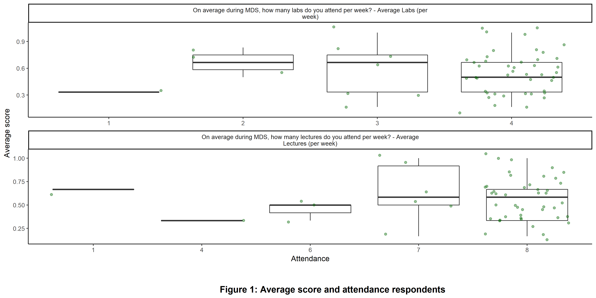
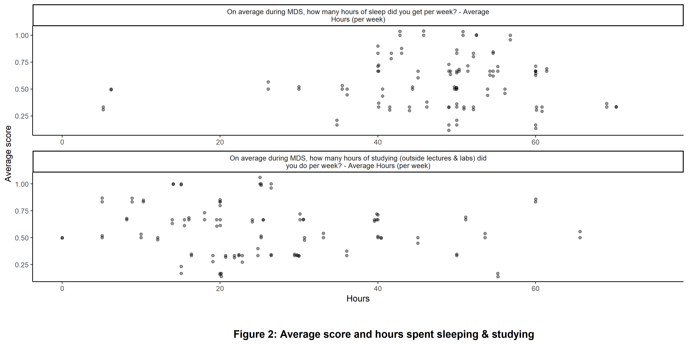
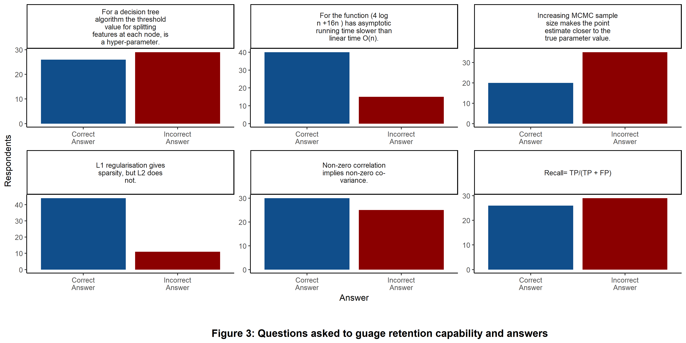
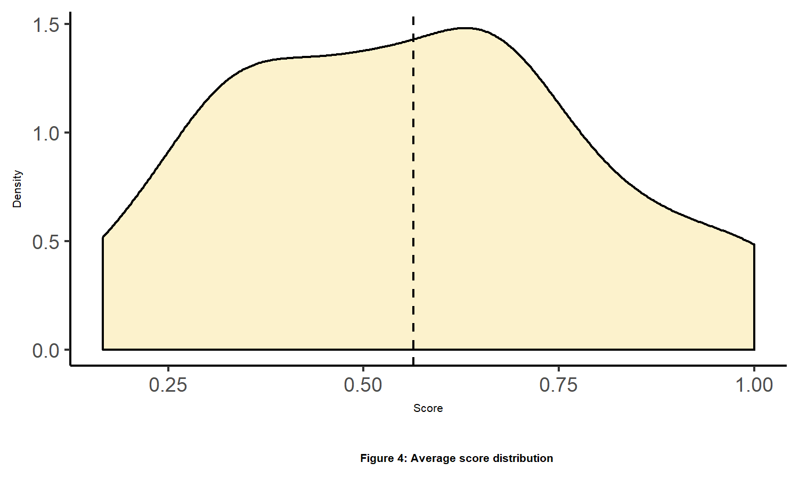

MDS Retention Survey Report
================

#### *Authors: Harjyot Kaur, Mike Yuan, Sayanti Gosh, Shayne Andrews*

Introduction
------------

The topic of interest around which the survey was designed is: Does hours of sleep/study/lectures influence retention level of MDS material?

The University of British Columbia recently [launched a new professional Master's Degree in Data Science](https://science.ubc.ca/news/ubc-launches-10-month-interdisciplinary-data-science-program) (MDS), with the first cohort in September 2017. The program is very intensive, with 24 1-credit courses squeezed into only 8 months, followed by a 2-month capstone project.

Given the fast-paced nature of MDS, we are interested in understanding the level of retention of material covered in MDS for both current students and alumni. We'd like to understand which key variables are associated with high levels of retention.

2.0 Methods
-----------

### 2.1 Survey Study Design

The survey questions are bifurcated into two groups. The first set of questions focus on gathering details that cater to respondent's
- Year of study (Student or Alumni)
- Attendance in lectures
- Attendance in labs
- Hours of sleep
- Hours of study

The second set of questions were designed to assimilate retention of the respondent through the course of the MDS program. The questions in this sections were questions that were previously perceived by the respondent as a question on the quiz or during lectures. A set of six True/False questions were structured that were evenly spread out in terms of the concepts taught in the program in an interim of seven months. This section was also timed, so as to make sure the respondents respond in a stipulated time frame.

To view the survey, click [here](https://ubc.ca1.qualtrics.com/jfe/form/SV_eUS5juWqmoXA1Ux)

### 2.2 Data Collection Methods

For data collection the survey link was sent to the current cohort of the MDS program and the alumni from the previous two cohorts. Responses from 55 respondents was collected.

To view the data collected, click [here](https://github.ubc.ca/MDS-2018-19/MDS_Retention/blob/master/data/mds-retention_2019-04-04.csv)

### 2.3 Analysis Methods

The data collected had the following variables:
- Cohort the respondent belonged to
- Average number of lectures attended in a week
- Average number of labs attended in a week
- Average hours of sleep during a week
- Average hours of study (outside labs and lectures) during a week
- Average score on the retention questions

The dependent variable is average score and the independent variables (including confounders) are the rest. Multiple linear regression was used to study the association between the average score (criterion for retention) and the hours devoted by the respondent in attending lectures, labs, sleeping and studying. Further a sequential sum of squares was conducted to analyze set of predictors that were significant in explaining the average score.

3.0 Results and Analysis
------------------------

### Exploratory Data Analysis

The spread of respondents who took the survey was varied in terms of the cohort they belonged to. Mostly respondents belonged to the current cohort i.e students currently in the MDS program (2018-19). There was lack of data from 2016-17 and 2017-18 cohorts.

Attendance of respondents in labs and lectures was deemed as a critical deciding factor to measure retention of MDS material. The MDS curriculum has 4 labs and 8 lectures scheduled in a week. It was observed that most of the respondents had high rate of attendance in both labs and lectures on average in a week. Although, the most of respondents attended the scheduled labs and lectures, the score of retention were quite spread out.

Sleep is pivotal for studies conducted around retention. The other two deciding factors in the study were average number of hours spent (in a week) on studying outside the lectures and labs, and average number of hours devoted to sleep in a week. Given, the program is intensive and accelerated, the study aimed towards analyzing if the hours of sleep or extra studying had a strong relationship with retention of the students.

The hours spent sleeping and studying were varied across the respondents. Most respondents slept between 40-60 hours in a week and studied for 10-30 hours in a week. The performance of respondents in these ranges was quite dispersed.

The following figure showcases how the performance of the respondents on questions asked to gauge retention of MDS material. Out of the six questions asked, majority of the respondents were able to answer two questions correctly. For three questions there was an almost even split in the answers and for one question majority of the respondents answered incorrectly.

The distribution of the average score the respondents achieved on the six questions shows that majority of respondents secured a score between 0.5 - 0.75. The average of the scores was observed to be around ~0.56.

Analysis
--------

To study the relationship between predictors that corresond towards a significant effect in retention, a sequential sum of squares was done. To conduct the same, a multiple linear regression was done keeping average score as response and predcitors as attendance in labs, attendance in lectures, hours spent studying, hours devoted to sleep and gap in year of study. The response for the cohort to which the respondent belonged to was modified to get the variable gap in year of study. This was done to analyze if the gap (difference between the current year and when the respondent was enrolled in the program) had any effect on retention. Multiple linear regression was conducted with all predictors retaining main effects, two way interactions and three way interactions. Further an anova was done to observe the sequential sum of squares.

 

<table>
<caption>
Table 1: Sequential Sum of Squares
</caption>
<thead>
<tr>
<th style="text-align:right;">
X
</th>
<th style="text-align:left;">
term
</th>
<th style="text-align:right;">
df
</th>
<th style="text-align:right;">
sumsq
</th>
<th style="text-align:right;">
meansq
</th>
<th style="text-align:right;">
statistic
</th>
<th style="text-align:right;">
p.value
</th>
</tr>
</thead>
<tbody>
<tr>
<td style="text-align:right;">
1
</td>
<td style="text-align:left;">
study\_gap
</td>
<td style="text-align:right;">
1
</td>
<td style="text-align:right;">
0.0710227
</td>
<td style="text-align:right;">
0.0710227
</td>
<td style="text-align:right;">
1.1530793
</td>
<td style="text-align:right;">
0.2902532
</td>
</tr>
<tr>
<td style="text-align:right;">
2
</td>
<td style="text-align:left;">
lec
</td>
<td style="text-align:right;">
1
</td>
<td style="text-align:right;">
0.0008311
</td>
<td style="text-align:right;">
0.0008311
</td>
<td style="text-align:right;">
0.0134935
</td>
<td style="text-align:right;">
0.9081883
</td>
</tr>
<tr>
<td style="text-align:right;">
3
</td>
<td style="text-align:left;">
lab
</td>
<td style="text-align:right;">
1
</td>
<td style="text-align:right;">
0.0007661
</td>
<td style="text-align:right;">
0.0007661
</td>
<td style="text-align:right;">
0.0124384
</td>
<td style="text-align:right;">
0.9118350
</td>
</tr>
<tr>
<td style="text-align:right;">
4
</td>
<td style="text-align:left;">
sleep
</td>
<td style="text-align:right;">
1
</td>
<td style="text-align:right;">
0.0167547
</td>
<td style="text-align:right;">
0.0167547
</td>
<td style="text-align:right;">
0.2720179
</td>
<td style="text-align:right;">
0.6052663
</td>
</tr>
<tr>
<td style="text-align:right;">
5
</td>
<td style="text-align:left;">
study
</td>
<td style="text-align:right;">
1
</td>
<td style="text-align:right;">
0.0675164
</td>
<td style="text-align:right;">
0.0675164
</td>
<td style="text-align:right;">
1.0961521
</td>
<td style="text-align:right;">
0.3022889
</td>
</tr>
<tr>
<td style="text-align:right;">
6
</td>
<td style="text-align:left;">
lec:lab
</td>
<td style="text-align:right;">
1
</td>
<td style="text-align:right;">
0.0185631
</td>
<td style="text-align:right;">
0.0185631
</td>
<td style="text-align:right;">
0.3013789
</td>
<td style="text-align:right;">
0.5865048
</td>
</tr>
<tr>
<td style="text-align:right;">
7
</td>
<td style="text-align:left;">
study\_gap:sleep
</td>
<td style="text-align:right;">
1
</td>
<td style="text-align:right;">
0.0130954
</td>
<td style="text-align:right;">
0.0130954
</td>
<td style="text-align:right;">
0.2126078
</td>
<td style="text-align:right;">
0.6475837
</td>
</tr>
<tr>
<td style="text-align:right;">
8
</td>
<td style="text-align:left;">
lec:sleep
</td>
<td style="text-align:right;">
1
</td>
<td style="text-align:right;">
0.0032232
</td>
<td style="text-align:right;">
0.0032232
</td>
<td style="text-align:right;">
0.0523306
</td>
<td style="text-align:right;">
0.8203879
</td>
</tr>
<tr>
<td style="text-align:right;">
9
</td>
<td style="text-align:left;">
lab:sleep
</td>
<td style="text-align:right;">
1
</td>
<td style="text-align:right;">
0.1112771
</td>
<td style="text-align:right;">
0.1112771
</td>
<td style="text-align:right;">
1.8066227
</td>
<td style="text-align:right;">
0.1875621
</td>
</tr>
<tr>
<td style="text-align:right;">
10
</td>
<td style="text-align:left;">
study\_gap:study
</td>
<td style="text-align:right;">
1
</td>
<td style="text-align:right;">
0.0000598
</td>
<td style="text-align:right;">
0.0000598
</td>
<td style="text-align:right;">
0.0009703
</td>
<td style="text-align:right;">
0.9753274
</td>
</tr>
<tr>
<td style="text-align:right;">
11
</td>
<td style="text-align:left;">
lec:study
</td>
<td style="text-align:right;">
1
</td>
<td style="text-align:right;">
0.0528480
</td>
<td style="text-align:right;">
0.0528480
</td>
<td style="text-align:right;">
0.8580063
</td>
<td style="text-align:right;">
0.3606407
</td>
</tr>
<tr>
<td style="text-align:right;">
12
</td>
<td style="text-align:left;">
lab:study
</td>
<td style="text-align:right;">
1
</td>
<td style="text-align:right;">
0.0056946
</td>
<td style="text-align:right;">
0.0056946
</td>
<td style="text-align:right;">
0.0924534
</td>
<td style="text-align:right;">
0.7628814
</td>
</tr>
<tr>
<td style="text-align:right;">
13
</td>
<td style="text-align:left;">
sleep:study
</td>
<td style="text-align:right;">
1
</td>
<td style="text-align:right;">
0.0008801
</td>
<td style="text-align:right;">
0.0008801
</td>
<td style="text-align:right;">
0.0142886
</td>
<td style="text-align:right;">
0.9055352
</td>
</tr>
<tr>
<td style="text-align:right;">
14
</td>
<td style="text-align:left;">
lec:lab:sleep
</td>
<td style="text-align:right;">
1
</td>
<td style="text-align:right;">
0.0285542
</td>
<td style="text-align:right;">
0.0285542
</td>
<td style="text-align:right;">
0.4635871
</td>
<td style="text-align:right;">
0.5004323
</td>
</tr>
<tr>
<td style="text-align:right;">
15
</td>
<td style="text-align:left;">
lec:lab:study
</td>
<td style="text-align:right;">
1
</td>
<td style="text-align:right;">
0.0019973
</td>
<td style="text-align:right;">
0.0019973
</td>
<td style="text-align:right;">
0.0324271
</td>
<td style="text-align:right;">
0.8581321
</td>
</tr>
<tr>
<td style="text-align:right;">
16
</td>
<td style="text-align:left;">
study\_gap:sleep:study
</td>
<td style="text-align:right;">
1
</td>
<td style="text-align:right;">
0.0038235
</td>
<td style="text-align:right;">
0.0038235
</td>
<td style="text-align:right;">
0.0620756
</td>
<td style="text-align:right;">
0.8047013
</td>
</tr>
<tr>
<td style="text-align:right;">
17
</td>
<td style="text-align:left;">
lec:sleep:study
</td>
<td style="text-align:right;">
1
</td>
<td style="text-align:right;">
0.2786336
</td>
<td style="text-align:right;">
0.2786336
</td>
<td style="text-align:right;">
4.5237166
</td>
<td style="text-align:right;">
0.0405522
</td>
</tr>
<tr>
<td style="text-align:right;">
18
</td>
<td style="text-align:left;">
lab:sleep:study
</td>
<td style="text-align:right;">
1
</td>
<td style="text-align:right;">
0.0830777
</td>
<td style="text-align:right;">
0.0830777
</td>
<td style="text-align:right;">
1.3487956
</td>
<td style="text-align:right;">
0.2533483
</td>
</tr>
<tr>
<td style="text-align:right;">
19
</td>
<td style="text-align:left;">
lec:lab:sleep:study
</td>
<td style="text-align:right;">
1
</td>
<td style="text-align:right;">
0.0017543
</td>
<td style="text-align:right;">
0.0017543
</td>
<td style="text-align:right;">
0.0284824
</td>
<td style="text-align:right;">
0.8669513
</td>
</tr>
<tr>
<td style="text-align:right;">
20
</td>
<td style="text-align:left;">
Residuals
</td>
<td style="text-align:right;">
35
</td>
<td style="text-align:right;">
2.1557888
</td>
<td style="text-align:right;">
0.0615940
</td>
<td style="text-align:right;">
NA
</td>
<td style="text-align:right;">
NA
</td>
</tr>
</tbody>
</table>
It was observed that the change in sum of squares was significant (p&lt;0.05 for lec:sleep:study) when the predictor, attendance in labs, was added to a model with predictors hours spent sleeping in studying. This suggests further investigation of the relationship of these three predictors with the response. Two multiple linear models were built one without interaction and one with interactions. This was done to study if the interaction of predictors led to significantly explaining the response.

<table>
<caption>
Table 2: Multiple Linear Regression (Without Interaction)
</caption>
<thead>
<tr>
<th style="text-align:right;">
X
</th>
<th style="text-align:left;">
term
</th>
<th style="text-align:right;">
estimate
</th>
<th style="text-align:right;">
std.error
</th>
<th style="text-align:right;">
statistic
</th>
<th style="text-align:right;">
p.value
</th>
</tr>
</thead>
<tbody>
<tr>
<td style="text-align:right;">
1
</td>
<td style="text-align:left;">
(Intercept)
</td>
<td style="text-align:right;">
0.4785614
</td>
<td style="text-align:right;">
0.2616598
</td>
<td style="text-align:right;">
1.8289451
</td>
<td style="text-align:right;">
0.0732577
</td>
</tr>
<tr>
<td style="text-align:right;">
2
</td>
<td style="text-align:left;">
lec
</td>
<td style="text-align:right;">
0.0108982
</td>
<td style="text-align:right;">
0.0277824
</td>
<td style="text-align:right;">
0.3922701
</td>
<td style="text-align:right;">
0.6964933
</td>
</tr>
<tr>
<td style="text-align:right;">
3
</td>
<td style="text-align:left;">
sleep
</td>
<td style="text-align:right;">
0.0014333
</td>
<td style="text-align:right;">
0.0026809
</td>
<td style="text-align:right;">
0.5346587
</td>
<td style="text-align:right;">
0.5952093
</td>
</tr>
<tr>
<td style="text-align:right;">
4
</td>
<td style="text-align:left;">
study
</td>
<td style="text-align:right;">
-0.0025107
</td>
<td style="text-align:right;">
0.0022321
</td>
<td style="text-align:right;">
-1.1247895
</td>
<td style="text-align:right;">
0.2659442
</td>
</tr>
</tbody>
</table>
<table>
<caption>
Table 3: Multiple Linear Regression (With Interaction)
</caption>
<thead>
<tr>
<th style="text-align:right;">
X
</th>
<th style="text-align:left;">
term
</th>
<th style="text-align:right;">
estimate
</th>
<th style="text-align:right;">
std.error
</th>
<th style="text-align:right;">
statistic
</th>
<th style="text-align:right;">
p.value
</th>
</tr>
</thead>
<tbody>
<tr>
<td style="text-align:right;">
1
</td>
<td style="text-align:left;">
(Intercept)
</td>
<td style="text-align:right;">
52.5619064
</td>
<td style="text-align:right;">
20.9710313
</td>
<td style="text-align:right;">
2.506405
</td>
<td style="text-align:right;">
0.0157147
</td>
</tr>
<tr>
<td style="text-align:right;">
2
</td>
<td style="text-align:left;">
lec
</td>
<td style="text-align:right;">
-6.5180004
</td>
<td style="text-align:right;">
2.6235161
</td>
<td style="text-align:right;">
-2.484452
</td>
<td style="text-align:right;">
0.0165943
</td>
</tr>
<tr>
<td style="text-align:right;">
3
</td>
<td style="text-align:left;">
sleep
</td>
<td style="text-align:right;">
-0.9401437
</td>
<td style="text-align:right;">
0.3812536
</td>
<td style="text-align:right;">
-2.465928
</td>
<td style="text-align:right;">
0.0173711
</td>
</tr>
<tr>
<td style="text-align:right;">
4
</td>
<td style="text-align:left;">
study
</td>
<td style="text-align:right;">
-1.5706496
</td>
<td style="text-align:right;">
0.6444070
</td>
<td style="text-align:right;">
-2.437356
</td>
<td style="text-align:right;">
0.0186337
</td>
</tr>
<tr>
<td style="text-align:right;">
5
</td>
<td style="text-align:left;">
lec:sleep
</td>
<td style="text-align:right;">
0.1180851
</td>
<td style="text-align:right;">
0.0477018
</td>
<td style="text-align:right;">
2.475485
</td>
<td style="text-align:right;">
0.0169663
</td>
</tr>
<tr>
<td style="text-align:right;">
6
</td>
<td style="text-align:left;">
lec:study
</td>
<td style="text-align:right;">
0.1966921
</td>
<td style="text-align:right;">
0.0806415
</td>
<td style="text-align:right;">
2.439094
</td>
<td style="text-align:right;">
0.0185546
</td>
</tr>
<tr>
<td style="text-align:right;">
7
</td>
<td style="text-align:left;">
sleep:study
</td>
<td style="text-align:right;">
0.0283685
</td>
<td style="text-align:right;">
0.0118282
</td>
<td style="text-align:right;">
2.398390
</td>
<td style="text-align:right;">
0.0204892
</td>
</tr>
<tr>
<td style="text-align:right;">
8
</td>
<td style="text-align:left;">
lec:sleep:study
</td>
<td style="text-align:right;">
-0.0035601
</td>
<td style="text-align:right;">
0.0014807
</td>
<td style="text-align:right;">
-2.404328
</td>
<td style="text-align:right;">
0.0201962
</td>
</tr>
</tbody>
</table>
In Table 2, Multiple Linear Regression without interaction none of the pvalues were significant whereas in Table 3, in Multiple Linear Regression with interaction effects, all p-values were significant (0.05). From the results it can be interpreted that the predictors alone (main effects) led to a decrease in retention, however, the interaction of the predictors led to increase in the retetion.

The study suggests that for a students in MDS, retention capability can be enhanced by following any pairwise combination of these three attributes, attending lectures, sleeping appropriately and spending time on studying outside labs lectures. Since the the amount of data collected was from a small population it is hard to comment with certainity on the nature of the results. It would be interesting to collect more data and investigate this study further.

4.0 Discussion
--------------

Overall the study suggests that for a student pursuing the MDS program should not only attend lectures or only study outside the scheduled lectures and labs or should not only sleep but combining any of these two could lead to enhancing retention capability. Holistically, the result does make sense as a student should attend lectures to gain knowledge, sleep appropriate hours and also extend efforts towards studying outside of classroom hours. Although the results seem interesting, the number of survey respondents is small and therefore the p-values are still too large to be conclusive (between 0.01 and 0.05).

To make the study as causal as possible, we designed our survey with quiz questions taken from material taught in the course of 7-8 months in the MDS program. This seemed like a better alternative than allowing people to subjectively self-rate their retention level. However, given the time constraint and nature of the survey we wanted to keep it as brief as possible. Using different questions might have led to different results. A longer set of questions would have been ideal to gain more certainty in our key variable of interest.

Also, it might be a possibility that there could be other confounding variables leading to retention that we were not able to cover in our survey such as background, level of recent study, specific interests in data science domain. This study could serve as a precursor for a more detailed survey with more responses. Despite the small number of respondents and brief assessment of retention, the results are interesting and make some intuitive sense, which should motivate any future studies on this subject.
