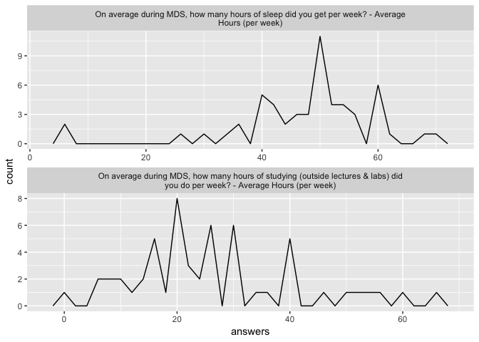
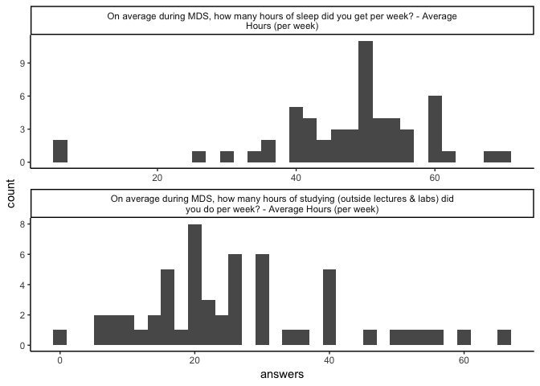
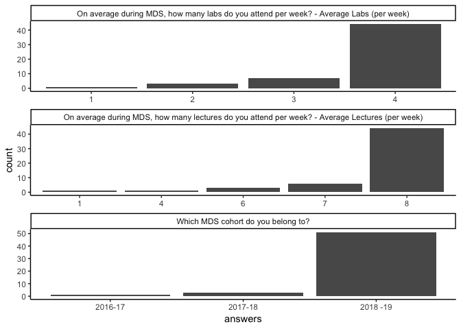
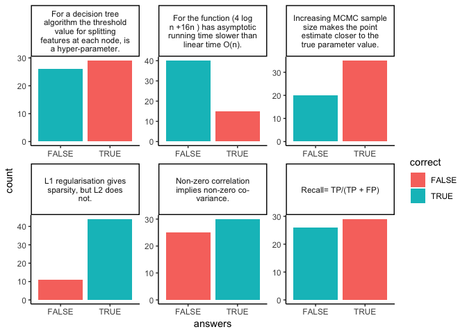
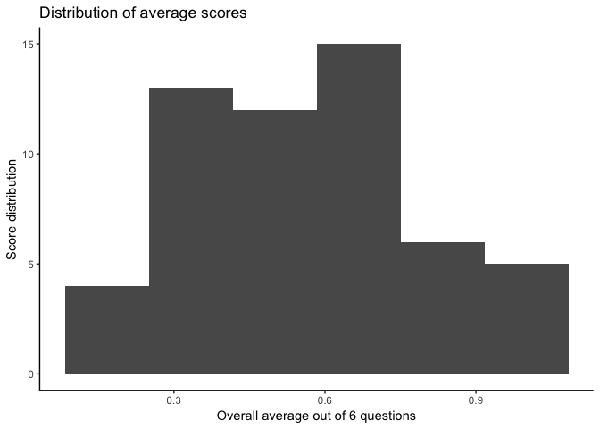
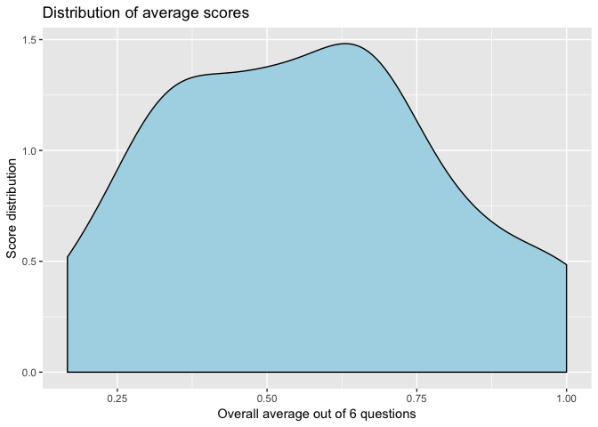

# Data Exploratory and Visualization

@author: Mike Yuan, Shayne Andrew

Date: April 2019

About: This file is meant to read the raw csv, perform EDA and basic
data cleaning

## Load Library and helper functions

``` r
# import library
library(tidyverse)
```

    ## ── Attaching packages ─────────────────────────────────────────────────────────────────────────────────────────── tidyverse 1.2.1 ──

    ## ✔ ggplot2 3.1.0     ✔ purrr   0.2.5
    ## ✔ tibble  1.4.2     ✔ dplyr   0.7.8
    ## ✔ tidyr   0.8.2     ✔ stringr 1.3.1
    ## ✔ readr   1.2.1     ✔ forcats 0.3.0

    ## ── Conflicts ────────────────────────────────────────────────────────────────────────────────────────────── tidyverse_conflicts() ──
    ## ✖ dplyr::filter() masks stats::filter()
    ## ✖ dplyr::lag()    masks stats::lag()

``` r
library(ggplot2)
library(stringr)
```

``` r
# helper functions

to_bool <- function(x) {ifelse(x == 'True', TRUE, FALSE)}
```

## Define global varible for binwidth when plotting histogram

``` r
# set global variables

BIN_WIDTH = 2.0
PREPATH = ''
```

## Reading and preparing the data dataframe

**important** Depend on where you run the file, assigned `"../"` to
`PREPATH` above. Otherwise, keep it `''` if you are running from
project’s `root` directory

``` r
# read csv
raw_df <- read.csv(paste(PREPATH, 'data/mds-retention_2019-04-04.csv', sep="" ),
  stringsAsFactors = FALSE)

# load answer keys

answer_key <- read.csv(paste(PREPATH, 'data/answer_key.csv', sep="" ),
  stringsAsFactors = FALSE)
```

``` r
# data cleaning
# remove second row as irrlevant
raw_df <- raw_df[-2,]

# get only the questions
raw_df <- raw_df %>% select(matches("Q[0-9]"))
questions <- unname(unlist(raw_df[1,]))

# removed unwanted row and enforce questions as columns
raw_df <- raw_df[-1,]
names(raw_df) <- questions

#  get deciding factors
d_factors <- raw_df[,1:5]

# convert character to numeric for hours
d_factors[,2:5] <- sapply( d_factors[,2:5], as.numeric )

retentions <- raw_df[,6:ncol(raw_df)]
# convert character to bool for retention question
retentions <- retentions %>%
  mutate_all(to_bool)

# enforce the questions in answer_key and dataframe matche
answer_key$questions <- colnames(retentions)
```

``` r
# save clean data
clean_df <- d_factors %>%
  cbind(retentions)


cat(sprintf("\n========>saving clean data to result\n\n"))
```

    ## 
    ## ========>saving clean data to result

``` r
write.csv(clean_df , file = paste(PREPATH, 'result/clean_data_long.csv', sep=""))

# showing the head of the clean data for Rmd
#head(clean_df)
```

### Preparing clean data for data analysis

The goal here is to create a clean dataset with shorter header and score
for each question Also, include the average score

``` r
# prepare for clean data with short handing for data anaysis
clean_data_short <- clean_df

# d for deciding factors
# r for retention questions
# s for score for each retention question
colnames(clean_data_short) <- c('d1', 'd2', 'd3', 'd4', 'd5',
                                'r1', 'r2', 'r3', 'r4', 'r5', 'r6')
clean_data_short <- clean_data_short %>%
  mutate(s1 = (r1 == TRUE),
         s2 = (r2 == FALSE),
         s3 = (r3 == FALSE),
         s4 = (r4 == TRUE),
         s5 = (r5 == FALSE),
         s6 = (r6 == FALSE)) %>%
  mutate(average = (s1 + s2 + s3 + s4 + s5 + s6)/6)

cat(sprintf("\n========>saving clean data with short header and scores\n\n"))
```

    ## 
    ## ========>saving clean data with short header and scores

``` r
write.csv(clean_data_short , file = paste(PREPATH, 'result/clean_data_short.csv', sep=""))

head(clean_data_short)
```

    ##         d1 d2 d3   d4    d5    r1   r2    r3    r4    r5    r6    s1    s2
    ## 1 2018 -19  8  4 70.2 19.10 FALSE TRUE FALSE FALSE FALSE  TRUE FALSE FALSE
    ## 2 2018 -19  8  4 50.9 29.76  TRUE TRUE  TRUE  TRUE  TRUE  TRUE  TRUE FALSE
    ## 3 2018 -19  8  4 50.0 10.00 FALSE TRUE FALSE  TRUE FALSE  TRUE FALSE FALSE
    ## 4 2018 -19  8  4 50.0 20.16 FALSE TRUE FALSE FALSE  TRUE  TRUE FALSE FALSE
    ## 5 2018 -19  8  4 35.5 30.70  TRUE TRUE  TRUE FALSE FALSE FALSE  TRUE FALSE
    ## 6 2018 -19  8  4 40.1 20.03  TRUE TRUE  TRUE  TRUE FALSE FALSE  TRUE FALSE
    ##      s3    s4    s5    s6   average
    ## 1  TRUE FALSE  TRUE FALSE 0.3333333
    ## 2 FALSE  TRUE FALSE FALSE 0.3333333
    ## 3  TRUE  TRUE  TRUE FALSE 0.5000000
    ## 4  TRUE FALSE FALSE FALSE 0.1666667
    ## 5 FALSE FALSE  TRUE  TRUE 0.5000000
    ## 6 FALSE  TRUE  TRUE  TRUE 0.6666667

``` r
# make plot for deciding factors
cat(sprintf("\n========> saving deciding factor plots\n\n"))
```

    ## 
    ## ========> saving deciding factor plots

``` r
discrete_d_factor_plt <- d_factors[,c(-4,-5)] %>%
  gather(key="questions", value="answers") %>%
  ggplot(aes(x = answers)) +
  geom_bar( stat = 'count') +
  facet_wrap(~questions,scales = "free", ncol=1)

ggsave(filename="discrete_deciding_factors.png",
  plot=discrete_d_factor_plt,
  path= paste(PREPATH, 'img', sep=""))
```

    ## Saving 7 x 5 in image

``` r
continuous_d_factors_hist <- d_factors[,c(4,5)] %>%
    gather(key="questions", value="answers") %>%
    ggplot(aes(x = answers)) +
    geom_histogram(binwidth=BIN_WIDTH) +
    facet_wrap(~questions,scales = "free", ncol=1)

ggsave(filename="continuous_deciding_factors_hist.png",
  plot=continuous_d_factors_hist,
  path= paste(PREPATH, 'img', sep=""))
```

    ## Saving 7 x 5 in image

``` r
continuous_d_factors_preq <- d_factors[,c(4,5)] %>%
    gather(key="questions", value="answers") %>%
    ggplot(aes(x = answers)) +
    geom_freqpoly(binwidth=BIN_WIDTH) +
    facet_wrap(~questions,scales = "free", ncol=1)

ggsave(filename="continuous_deciding_factors_freqp.png",
  plot=continuous_d_factors_preq,
  path= paste(PREPATH, 'img', sep=""))
```

    ## Saving 7 x 5 in image

Show deciding factor plots

``` r
# show continous
continuous_d_factors_preq
```

<!-- -->

``` r
continuous_d_factors_hist
```

<!-- -->

``` r
discrete_d_factor_plt
```

<!-- -->

``` r
# plot the retention questions


retentions <- sapply( retentions, as.character )

# preparing the dataframe to get the correctness of each answer
retentions <- as.data.frame(retentions) %>%
    gather(key="questions", value="answers") %>%
    left_join(answer_key, by='questions') %>%
    mutate(correct = (answers == answer_key))


retentions_plot <- retentions %>%
  mutate(questions = str_wrap(questions, width =  25)) %>%
  ggplot(aes(x = answers, fill = correct)) +
  geom_bar(stat="count") +
  facet_wrap(~questions,scales = "free", ncol=3)

cat(sprintf("\n========> saving retention question plots\n\n"))
```

    ## 
    ## ========> saving retention question plots

``` r
ggsave(filename="retentions.png",
  plot=retentions_plot,
  path= paste(PREPATH, 'img', sep=""))
```

    ## Saving 7 x 5 in image

show renteion plot

``` r
# show retention plot
retentions_plot
```

<!-- -->

show distribution of the average scores

``` r
score_distribution_plot <- clean_data_short %>%
  ggplot(aes(x = average)) +
  geom_density( fill ='lightblue') +
  labs(title='Distribution of average scores',
       x='Overall average out of 6 questions',
       y = 'Score distribution')


cat(sprintf("\n========> saving score average distribution plot\n\n"))
```

    ## 
    ## ========> saving score average distribution plot

``` r
ggsave(filename="score_average.png",
  plot=score_distribution_plot,
  path= paste(PREPATH, 'img', sep=""))
```

    ## Saving 7 x 5 in image

``` r
# save historgram
score_hist_plot <- clean_data_short %>%
  ggplot(aes(x = average)) +
  geom_histogram(bins=6) +
  labs(title='Distribution of average scores',
       x='Overall average out of 6 questions',
       y = 'Score distribution')


cat(sprintf("\n========> saving score average histogram plot\n\n"))
```

    ## 
    ## ========> saving score average histogram plot

``` r
ggsave(filename="score_average_hist.png",
  plot=score_hist_plot,
  path= paste(PREPATH, 'img', sep=""))
```

    ## Saving 7 x 5 in image

Show score average plots

``` r
score_hist_plot
```

<!-- -->

``` r
score_distribution_plot
```

<!-- -->
